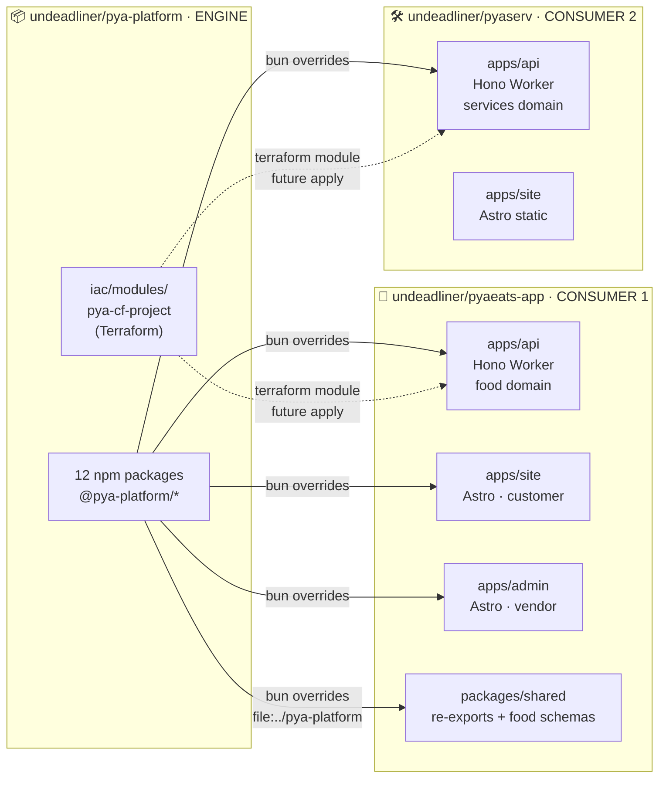
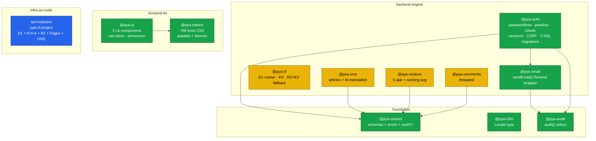
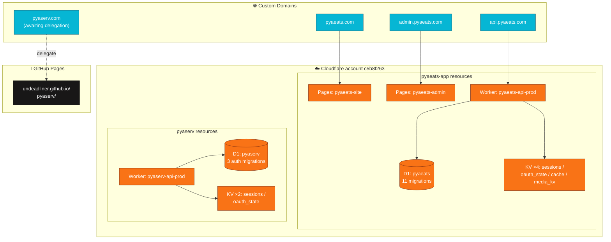

# Architecture

Snapshot of the platform + consumers as of 2026-06-12. Three Mermaid diagrams: top-level repo relationships → package map inside `pya-platform` → deployment topology.

## 1. Three repos — who pulls whom

## 2. Package map inside `pya-platform`

🟢 = real code · 🟡 = scaffold (lift completes in next Phase-6 follow-up) · 🔵 = Terraform.

## 3. Deployment topology

